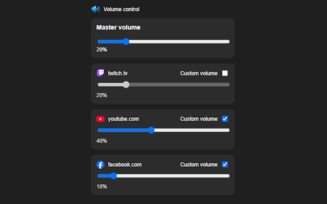

# Volume Per Site

A simple and lightweight Chrome extension to control audio volume globally and per website.

  

## Features

- Master volume control across all sites
- Per-site volume customization
- Instant updates across open tabs
- Automatic Preference Saving
- Clean and minimal interface

## How it works

- Use the **master slider** to control overall volume
- Enable **Custom volume** to override the master setting for a specific site
- Adjust the slider to set your preferred level

## Privacy

This extension does not collect, store, or transmit any personal data.

All settings are stored locally in the browser.

## License

This project is open-source for personal and non-commercial use only.
